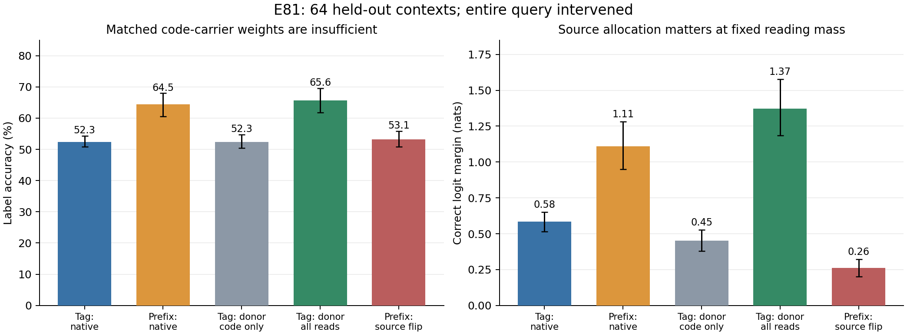
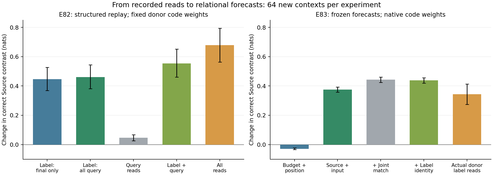
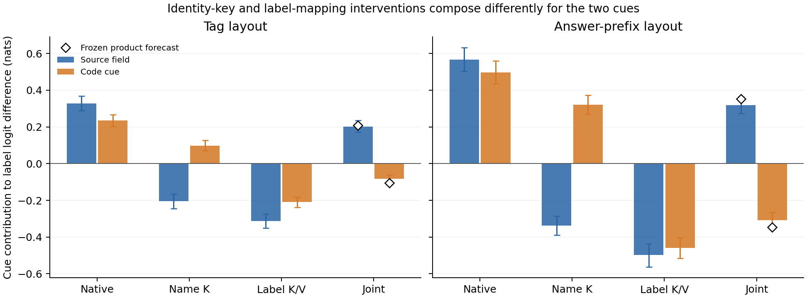

# ICES 当前进展与下一步：从证据混合到来源条件化的计算（2026-10-10）

**当前判断：ICES 已有可靠的现象、若干实质性的因果结果，以及值得组织成论文的认识；尚不能确信它已经是一篇强机制论文，也没有证据把整个项目判为 trivial。最有价值的下一步是把已有结果解释得更清楚，而不是再给项目增加一串必须通过的关卡。**

这份总结响应本次人的纠偏：耐心整理全部进展，收束下一步，上传 GitHub main。事实截至 E79；没有启动 E80。正式 ACTIVE-EXPLORE / I04 状态不变。这是当前综合判断，详细结果和原先跑前标准仍在[实验索引](experiments/INDEX.md)、[主张账本](CLAIMS.md)及[10 月 10 日详细复盘](REVIEW_2026-10-10.md)。下文的区间均为相应实验原报告的 95% CI；百分点与相对恢复比例分开写。

## 1. 我之前哪里做偏了

最初的担心有必要：不能把“模型犯错”“信息可解码”“小模块修好了”直接等同于重要机制发现。但随后我把局部探索的有效性控制，逐渐变成整条研究必须跨过的新门槛：来源 probe → native 路径 → query 接力 → 函数状态 → 缺失类别 → 函数识别 → 数字执行 → 共享词典。每次发现混杂就再换一个任务，结果越来越关注新任务能否跑通，反而没有充分消化 E59–E71 已经给出的计算认识。

纠正这些误读是进步，却不意味着每纠正一次，ICES 的论文标准就必须再升一次。E76 的中点捷径限制 E76 的函数解释；E78 的顺序效应限制那组函数偏好解释；E79 的执行阳性失败限制共享词典的机制归因。它们都不取消原来的证据混合现象，也不取消已经测出的来源因果路径、query 内部计算或载体位置效应。

同样，跑前 MIE 是判断该次实验能否支持预定解释的工具，不是科学价值的自动开关。E71 冻结偏移迁移恢复 **35.0% [23.1, 47.7]**、准确率 **+3.1 点 [0.8, 5.5]**，没有达到原设 50% / 5 点，但它仍然是正的部分迁移证据，不能被概括成“没有可迁移结构”。

## 2. 全部实验积累，实际让什么变得更清楚

| 阶段 | 主要结果 | 留下的认识与边界 |
|---|---|---|
| E00–E11 | 条件映射的噪声检验与标签流、输出格式出现解离；跨模型结果更接近集合式汇总，而非指定变化点 oracle | 输出变化与输入—输出关系变化不等价。exact Bayesian oracle 对指定生成模型精确，不是所有 prompt 唯一合理的规范参照 |
| E12–E19 | toy 训练、LoRA、任务与规模控制 | 提供训练统计的线索，没有建立默认行为的完整训练成因；早期 thinking 失败也不能推广到所有 reasoning models |
| E20–E29 | 最近邻与最近期分开；同一答案中格式可变而映射不重置；不均衡任务中条件成分仍错向 | 原现象不是一个笼统的“不会追踪上下文”。不同输出成分使用时间信息的方式不同 |
| E30–E35 | 输出词表分开时泄漏接近 0；输入域分隔约 0.36–0.49、上下文标签约 0.51–0.91；换词使 11/12 漂移条件改善；标签相似度相关 ρ=0.75–0.96 | 输出身份是重要的组织变量。相关涉及约 13–14 套词表，不能独立证明语义相似度是唯一因果变量；换词也改变答案结构与任务标识 |
| E36–E39 | 标签读取的分解与因果交换；逐头重建 r=0.9997；消融正常映射与泄漏一起下降 | 通用 ICL 检索通路参与泄漏，尚不能说找到了独立的“错误模块” |
| E40–E45 | 顺序、格式相关探索及控制 | 按当时记录保留为诊断材料，不重新赋予中心地位 |
| E46–E49 | 2 个真实多人标注数据集、8 模型、4 家族：混合保留个人倾向约 35–58%，交互约 27–48%；匹配词表基准后，分开输出词多能恢复到约 0.80–1.27 | 受控现象能延伸到真实标注分歧，不只是玩具漂移；也不是所有模型、所有换词条件都完全恢复 |
| E50–E54 | 三个实际预测设置没有同样明显的准确率损失；更复杂语义的来源区分约 0.31–0.52 | 内部区分损失不自动意味着应用损失。不能写“多人 ICL 无法工作”，也不能把更多真实数据当成唯一意义来源 |
| E55–E56c | 来源 probe 可读；冻结主模型的 query LoRA 准确率约 0.54→0.91，超过单来源参照；联合换任务/标签后的迁移有限 | 表示可读、native 使用、额外训练后可部署是三件事。rank 8 是约 20 层各自的秩，共 1,310,720 个训练参数；不是免费打开一个八维开关 |
| E58–E66 | 可跨标签的来源差分；来源名字 K 的 native 中介；whole-query label 消息；query 接力与缓存状态的负结果 | “默认完全不用来源”被撤回。来源条件化分布在 query 内，末位标签读取不足以代表整个程序；没有证明完整函数状态可独立移植 |
| E67–E71 | 来源码位置效应、label-blind 历史、公共 prefix-key 偏移、关系码×位置独立确认 | 同样存在的身份信息，进入不同结构角色会改变效果；载体可见性、来源选择与预测恢复可以分离。是目前最值得集中解释的链条 |
| E72–E75 | 原生推理、预算与解析校对；较新 27B 普通多来源 pilot 全对；8B 来源内双射补全全对 | 强模型和有效 reasoning 能解部分任务。原始候选评分或截断失败不证明能力缺失；还没有独立前沿模型的全面结论 |
| E76–E79 | 中点/加性捷径、单来源函数失败、定义顺序效应、共享词典执行阳性失败 | 新任务帮助约束解释，尚未带来新的通用组合规律。不把它们的全部有效性控制变成 ICES 主线的必要条件 |

这里的积累有两种价值：一是现象覆盖已相当扎实；二是后续反例逼我们拆开了原本混在一起的机制判断。后者不只是坏消息，但纠正自己的误读也不会自动变成领域贡献。

## 3. 目前最强的认识链条是 E59–E71

### 3.1 来源信息确实进入默认计算，但不能只看答案末位

[E59](experiments/E59-source-mediation-sites.md) 中，来源交换的影响主要经来源名字 K 中介；[E61](experiments/E61-crossed-routing-payload.md) 中，它与标签 K/V 的作用存在非加性交互。这比 probe 更接近实际计算，但 hybrid 中介比例依赖具体反事实，不代表找到完整且唯一的串行电路。

[E64](experiments/E64-whole-query-message-mediation.md) 的更强结果，是改变测量范围后因果结论明显改变：Qwen 独立合成确认中，冻结答案末位 label 消息仍剩 **0.471 [0.438, 0.508]** 的来源效应；冻结整个 query 后只剩 **0.061 [0.027, 0.094]**。独立真实评论池的受控来源规则任务为 **0.527 [0.476, 0.581]→0.054 [0.001, 0.102]**。Mistral 末位冻结已经只剩约 0.127，全 query 为 0.078，显示读取时序有模型差异。

这些比例是指定干预下的 logit 效应剩余，不是准确率，也不是互斥可加的机制份额。真实评论池使用人为规定的 race/gender 映射，不等于自然标注者规则。但结果已经足以改变我们自己的测量方式：在这类来源条件化任务中，只审视最后一个答案位置，可能把此前发生的条件计算误看成“来源没有被用”。

### 3.2 关系信息的结构角色影响行为，单纯扩展答案空间不足以解释

[E67](experiments/E67-source-code-at-answer-prefix.md) 把相同来源码从 Tag 字段移到答案 prefix，保持最终分类词不变。Qwen 独立确认准确率 **+7.4 点 [4.7, 10.5]**，来源排序 **+10.9 点 [5.5, 17.2]**。完整输出语法仍改变，且 prefix 是 teacher-forced，不能当成纯位置因果效应或端到端生成能力；Mistral 的准确率收益 CI 跨 0。

[E71](experiments/E71-relational-code-versus-carrier-access.md) 进一步保持 namespace、token 频率与布局相同，操纵码词是否与来源一一对应。新材料中，**关系码×位置的准确率交互 +10.9 点 [7.0, 15.2]**，margin 交互 +0.514 [0.427, 0.597]；来源排序交互 CI 跨 0。Source 字段本身仍充分给出身份，因此“只是新答案词更多”不足以解释该收益。当前只能说关系与结构角色共同影响这一分类程序，不能直接宣布新的 binding 构件。

### 3.3 预测变好，可以主要来自载体组更可见

[E68](experiments/E68-prefix-history-versus-local-address.md) 与 [E69](experiments/E69-label-blind-contextualization.md) 说明 prefix K 的历史上下文化重要，但在禁读历史 label 的条件下仍可保留作用；这不证明整个模型无须 label，也不证明 K 存着完整任务判决。

[E70](experiments/E70-common-frame-versus-example-specific-keys.md) 则构造了一个可解释的干预：给**所有 demo prefix-code token 这个载体组**添加相同 key 偏移。它不是给 Source A/B 各加一个不同偏移。固定 query 时，组内相对 logits 几乎不变（spread <4e−6），改变的是 prefix 组相对于其它 token 的可见性。

来自其它发现 context 的冻结偏移，在独立词库/标签确认中恢复 margin 损失的 **52.7% [27.4, 76.0]**，准确率 **0.543→0.602**，接近 native 0.605；但来源排序仍为 **0.828**，低于 native **0.938**。因此，这次预测修复不能完全读成来源绑定修复。E71 换名字/码词/词库/标签后仍有上述 35% 的正向部分迁移，作用有边界而非完全消失。

这个干预遍及 36 层、8 个 KV head、128 维，共 36,864 个浮点数，保留其它 native 缓存；不是一个全局标量，也不是独立足够的任务状态。它给出的有用认识是具体的：**某种看似来源条件化的性能恢复，可以由载体组可见性的改变介导，而组内来源选择仍未恢复到同样程度。**

## 4. 从更高一点的观点组织它，但不追求统一解释全部 ICL

当前可工作的中心问题是：

> **来源身份在什么条件下成为有效的证据选择坐标？它怎样进入 query 的计算，而信息载体更可见与来源选择更准确又分别改变了什么？**

一个候选解释是：来源条件化通过 query 内部的证据读取逐步形成；来源码所承担的结构角色会改变这个过程；提高承载关系信息的 token 组可见性可以改善预测，却不保证组内按来源选择正确。这是对一组来源条件化分类实验的有界解释，不是所有 ICL 的统一理论，也尚未证明三个环节在所有模型里构成同一条因果链。

它比“来源完全不用”“所有信息都按输出存放”更符合现在的结果，也不要求先解决任意函数推断、任意词典组合或所有 reasoning 模型。I04 的现象基础保留；原来的单一路径解释收窄。论文标题暂不锁定，先把这条已有链条讲准确。

同行可能因此改变的是具体的研究选择：考察 whole query 而非只考察末位；在干预后分别测预测与来源选择；对于位置/码词带来的恢复，检验它改变的是载体访问还是关系选择。这些原则的一般版本并非我们首创；潜在贡献在于**用同一来源条件化任务中的可辨别干预，把它们落实成可预测的计算解释**。是否已经足够独特、有力，仍须结合现有证据与近邻判断，不能只靠这段表述。

## 5. 已有文献给出的尺度与边界

我们已经持续读了这些主线，而非只按标题查重。详细阅读范围见[论文笔记](../../library/themes/in-context-evidence-structure/KEY_PAPERS.md)与独立论文卡。

| 近邻 | 已有认识 | ICES 应抓住的具体距离 |
|---|---|---|
| [Wang，label anchors](https://arxiv.org/html/2305.14160v3)；[Cho，ICL inference circuit](https://arxiv.org/html/2410.04468v3) | 标签锚点、输入编码/合并/检索复制、shortcut 与 forerunner | 不能把标签参与检索当新发现；研究来源条件如何进入这条程序及它的边界 |
| [Feng & Steinhardt，binding IDs](https://proceedings.iclr.cc/paper_files/paper/2024/hash/9d1b7fc578c0d2d6431fc26d736ecaf3-Abstract-Conference.html)；[Gur-Arieh，Mixing Mechanisms](https://arxiv.org/html/2510.06182v2) | 模型有绑定能力，检索可混用位置、词汇、reflexive 机制 | 不能以“多键绑定”新名称立贡献；需说明既有机制在来源条件化中的具体使用方式 |
| [Cho，information removal](https://arxiv.org/html/2509.21012v3) | ICL 可选择性移除已有表示中的无关信息；用 unseen-label 与构造性干预区分解释 | 学习其让解释产生分歧预测的实验动作，不要求我们也解释全部信息移除 |
| [Few-Shot Examples Add Up](https://arxiv.org/html/2605.16591v2)；[Contextualize-then-Aggregate](https://arxiv.org/html/2504.00132v2) | QK/V 与 alignment、上下文化内容与历史依赖已有解释 | 公共 key 偏移或历史必要性本身不新；价值在具体来源关系、载体与选择效应的分解 |
| [Lepori，表示与部署](https://aclanthology.org/2026.acl-long.676/)；[Li，Just-in-time task representations](https://arxiv.org/html/2509.04466v3) | 可读出的表示与后续部署、token 局部任务状态有区别 | 不把“有但不用”或“更早就有计算”当中心 novelty；转向实际 source-conditioned 路径 |
| [Liu，Incomplete Loop](https://arxiv.org/html/2404.03028v3)；[Khandelwal & Pavlick，function composition](https://arxiv.org/html/2510.01685v2) | 推断/预测/执行及原子能力/组合行为已有分离研究 | E77–E79 不能简单换名为新的组合缺陷；也不必为了超越它们，把 ICES 主线迁移到函数任务 |

从 Cho 学到的应是实验如何使认识变得更深，而非无止境增加复杂度。这里最好的已有转折是 E64 改变观察范围、E70 构造组内相对匹配不变的干预、E71 让相同 namespace 下的关系信息竞争。它们都有明确的解释收益，应先组织好。

## 6. E72–E79 要怎样保留

E72/E73 揭示了预算、截断和解析的影响：27B thinking 在 8 个 context 的普通多来源、linked-prefix、entity、single 条件全对；8B 同轨迹延长预算使 orthogonal 准确率 0.1875→0.8125，48 次实际前缀核对一致。部分 Markdown 漏判校正属于 POST-HOC，原严格评分保留。这支持“能力可能恢复，需要区分能力与默认程序”，但不等于所有强模型都解决或机制相同。

E74 即时缺失类别准确率约 32–36%，关键方向 CI 跨 0；E75 原生双射补全 full/held 各 **36/36** 正确，独立函数空间 **24/36** 正确、**12/36** 截断。保留它们作为来源约束可被推理利用的证据，不能从前者低分宣布普遍能力缺失。

E76 的 Source 响应 **3.648 [3.403, 3.883]** 可以复现，但 query 恒为示例中点，均值足以答对，加性任务也不要求完整组合。E77 排除这个捷径后，direct 规则执行全对，mixed 推断较弱；single identity 也弱，不能归因于独有的多来源瓶颈。

E78 只交换函数定义块，mixed subtract 插值 **96.1%→25.0%**，说明之前的函数不对称依赖定义顺序。模型自选 rule code 相对空字段仍带来 **+18.9 点 [10.2, 26.4] / +24.4 点 [16.8, 31.3]** 的插值/外推收益，但不足以证明可靠识别而不部署；一般中间指令反馈已有直接近邻。

最新 [E79](experiments/E79-parameter-evidence-versus-codebook-evidence.md) 试图区分私人规则参数与共享输出词典。16 个新 context、全部两个定义顺序保留；词典 lookup 约 **95–99%**、seen 几乎全对，但给出真实规则后，subtract 插值仍只有 **21.9% [6.3, 38.9]**、外推 **15.6% [6.7, 26.4]**。没有同 context 数值原子执行的阳性，不能说“两种原子都能做却不能组合”，也不能继续做 provenance 的机制归因。事后错误中经常输出 g(x)，只支持跳过变换的行为签名，不证明内部计算顺序。

**这些实验的作用是界定错误解释、提供未来工具，不是继续追加主线成立条件。** E79 原卡保留“若继续该分支应先检验原生/原子有效性”的建议；本次综合排序不优先执行它。没有正在运行的后续 GPU 分支。

## 7. 下一步只集中推进一个解释问题

先用 E59–E71 的现有数据，组织“query 内部来源条件化—载体访问—组内来源选择”的小范围解释，明确哪些比较已支持它、哪些仍是候选预测。优先处理已有结果之间的关系，不先重写论文、不扫模型、不增加函数与词典任务。

下一次新增实验只围绕一个区别：**Tag 与答案 prefix 的差异，主要来自承载关系信息的 token 组更可见，还是来自组内更好的来源/样例匹配及上下文化内容？** 一个可行 pilot 是在 E67/E71 分类任务上，对照控制载体组获得的总 attention mass，并保留组内相对权重；同时报告 margin、准确率和来源排序，使用未参与挑选的 context/码词。精确操作范围还需在实验卡中确定；改变早层消息会改变后续 query，因此不会把这种干预说成全网完全隔离。

| 结果 | 真正改变的判断 |
|---|---|
| 匹配载体组可见性后，Tag/prefix 预测差明显缩小，而来源排序差仍在 | 更支持可见性与来源选择的分离；可解释部分格式收益，不称 binding 全修复 |
| 预测和来源排序差都主要保留 | 公共可见性不足以解释位置收益；集中到组内匹配/上下文化内容，不先扩大任务范围 |
| 干预阳性或质量控制无效 | 该 pilot 不可解释；只修具体干预问题，不因此撤回 E59–E71，也不另开一串能力门槛 |

这是一项聚焦的候选实验，不是承诺完整统一理论。读数与原先已有结果允许解释失败；失败只收窄该解释。后续动作由它实际留下的不确定性决定，不在结果回来前铺所有分支。

## 8. 当前四层判断与交付

| 层次 | 当前判断 |
|---|---|
| 空间 | 重要问题是身份信息如何进入 ICL 的证据选择程序；既有检索和绑定研究提供强参照，仍有具体成立边界可研究 |
| 线索 | 强。原现象稳定，E59–E71 已有 native 因果、观察范围、信息位置、可见性干预与独立关系确认 |
| 主张 | 输出身份影响汇总、来源会参与 native 计算、whole-query 范围重要、关系×位置影响预测、可见性恢复与来源选择恢复可分离。一般统一算法与新构件尚未证明 |
| 贡献 | 有值得进一步组织和验证的知识增量；关键是能否把这组结果变成有界且有预测力的解释。没有必要要求覆盖所有 ICL，也不能仅把已知区分的又一个例子包装成新理论 |

目前不建议放弃，也不建议仅凭实验数量宣布强论文。应当把 ICES 当作已有实质进展、需要一次认真综合的研究，而不是不断向外扩张才有资格被肯定的项目。最终论文形态与 scientific-yield 判断由人决定。

本次上传包含已有 E58–E79 的代码、实验卡、主张记录、小结果与论文笔记，以及本总结；checkpoint、原始 JSONL / 数组、模型权重保留在 README 所列本地路径。E79 分析脚本的 bool 相减修正不改科学评分、样本或门槛。流程检查仍是 0 ERROR / 64 个已有 WARN；本次不提升主张等级、不改变项目状态。

## 9. 对后续人审计的独立核对（2026-10-10追加）

我支持将自然问题表述为“多套规则共存时，模型怎样决定当前query应由哪些示例约束”。Tag/prefix是实验变量，不是中心问题。这个问题不依赖弱模型永远失败，但自然性本身也不证明novelty；已有框架不能直接预测一个效果量，不等于它们在机制上已经被排除。

重读Cho/QK近邻、读CoSToM§3–4及附录E/F，并补读新近邻[Selection–Realization](https://arxiv.org/html/2608.13385v1)§2–5后，需保留三个修正：

1. **source ranking是输出对来源的区分，不是直接的内部证据选择。** E70的预测与该输出指标分离很有价值，但尚不能单独宣布因果“访问/选择”双模块。原数字和证据等级不变。
2. **公共偏移并非必然增加载体读取。** 旧结果POST-HOC核对：E70确认prefix总mass由isolated **2.675%[2.619,2.735]**降至shared **1.488%[1.463,1.515]**；E71 own common **2.841%→1.873%**。同时预测改善。全层/全query平均不定位关键head，但已阻止“多关注所以修好”的单调解释；应说预算配置变化。证据`results/e70_e71_attention_audit_posthoc.json`。
3. **旧E71的D0 prefix是Mark。** 真码位于Tag，旧保存统计没有该组，不能直接把旧prefix质量当两种码载体的等价比较。这是测量对象纠正，不是取消位置收益。

| 已有操作 | 确实改变什么 | 保留什么／不能推出什么 |
|---|---|---|
| E59 source-name K交换 | 原生来源身份反事实的检索key | 其它cache基本保留；中介结果依赖反事实，非完整Source算法 |
| E61 label K/V与name K交叉 | 来源读取和映射消息的指定接口 | 非加性不自动识别独立模块或串行顺序 |
| E64全query label-message冻结 | query接收label消息的范围 | 原生源效应不能只用末位概括；尚未定位全部路径 |
| E68/E69历史mask与carrier K移植 | prefix上下文化信息与特定K | 其它native缓存/V保留，不能推出整个ICL无label历史 |
| E70公共prefix K偏移 | 固定Q下carrier组相对外部logit预算 | 组内相对logits局部不变；完整程序的后续Q/V可变，非全路径隔离 |
| E71关系×码位置 | 同namespace下冗余来源关系与结构角色 | 原生V/其它路径及输出语法同时作用，不是完整选择机制 |

因此继续的是一个具体机制解释，而非“已有framework都完全不够”的宽泛宣言。[E81](experiments/E81-carrier-mass-versus-source-allocation.md)按真实码载体对齐，整query固定m/pi目标、保持kind边缘翻转Source分配，观察最终判断能否因果分离；其它权重与V保留活反馈。竞争解释若被支持就据此收窄，不追数字变大，不加新的函数能力关卡。CoSToM给我们的尺度是问题与证据链，其额外监督/decoder验证不要求ICES也做同样方法。

## 10. E81已经完成：位置收益不是码carrier读取统计的直接复用

一个聚焦pilot（32新context）与同源码的独立确认（64新context）得到一致结果，科学GPU墙时合计0.0602小时。所有材料/错误donor保留，无筛样本；self及mask/目标权重控制通过。详细数值与操作见[E81](experiments/E81-carrier-mass-versus-source-allocation.md)。

| 确认条件 | accuracy | 它检验什么 |
|---|---|---|
| Tag native | 52.3% | 来源字段与码都在，但默认读取效果有限 |
| Prefix native | 64.5% | 相同Source/最终label，结构角色改变 |
| Tag仅接受Prefix码carrier的m/pi | 52.3% | 码carrier的读取统计未转移收益 |
| Tag接受角色对齐的whole-query attention | 65.6% | 更广读取分布可以转移收益，未从donor移植V |
| Prefix固定m/kind，翻转Source分配 | 53.1% | 组内Source分配具有独立的因果作用 |

**同Tag recipient、同码carrier m/pi下，whole-query比carrier-only增加13.3点[9.4,17.2]、margin+.918[.735,1.111]。** 不同的是对其它token的读取条件分布；demo cache/V保留，query内V/MLP活反馈。Source flip使Prefix margin−.849[−1.003,−.712]、accuracy−11.3点[−15.2,−7.8]，同时保持每层/head/query的码carrier总量及kind边缘。

这比“prefix多被看了一点”更具体：其Source分配有作用，但码carrier本身的选择不是位置收益的充分接口。native真实码的平均mass Tag 2.191%、Prefix 2.101%，requested-source份额60.9%/60.0%，也不支持简单的单调可见性解释。平均attention仍非完整机制；指定干预才提供这里的因果证据。

审计中的另一座推断桥也要收窄。输出ranking只测Source contrast方向，不测其强度或共同label偏置。记s为正确方向的Source分数差的一半、b为两Source共同分数；ranking检验s>0，两人都答对还需s>|b|。POST-HOC精确重建显示Tag whole-query移植主要提高s（.583→1.371），平均|b|并未下降（2.020→2.093）；bias差CI跨0，不作等效零结论。**accuracy/ranking的分离，不能单独证明“访问修复、绑定未修复”的两个模块。** bias/读出的一般解释已有[Cho Hidden Calibration](https://arxiv.org/html/2406.16535v3)等强近邻，不能把这个代数当新理论。

当前更合适的候选认识是：**Source cue通过query的读取程序改变相关证据的作用强度；实际cue载体的分配与其它证据的读取需要协调，不能只用“关注cue多少/关注谁”概括。** 这里的“需要协调”是上述受控接口的解释，尚不是完整新电路或跨任务抽象策略；whole-query donor可能已经带有答案相关选择。

这支持继续深入自然的证据选择问题，也明确了novelty应落在哪里：具体Source条件怎样改变读取程序及其反事实后果，而非一般QK/V不同、信息可读却不用或新的token名称。C20记L1；不立即再扫配置，下一步用已有因果区别构建能预测Source对比的有限解释，与已有框架实际比较。完整预测模型仍未完成，不能宣布强机制论文已定型。

## 11. E82–E84：开始预测读取变化，也找到预测器的具体解释边界

### E82：原生影响在哪里形成，与从哪里移植收益是两个问题

64新contexts确认：固定相同来源码读取后，替换demo Label读取提高accuracy **7.8点[3.9,11.7]**、Source contrast **.461[.381,.544]nats**；仅替换query内部读取提高.8点CI跨0、contrast .047[.026,.068]。Label在全query替换与只在末位替换，contrast差只有.014[.007,.023]nats。完整读取仍有其它效应，不把Label称唯一原因。

这收窄了原先期待的复杂接力故事。C16整query原生中介仍成立，E82末位收益也成立：前者干预原生Source身份影响，后者移植另一布局的读取政策。两者不是同一反事实。不能为追求完整叙事要求每个收益都必须重建整个原生程序；一般定位与可干预位置的区别已有文献，这里只是具体多来源ICL的证据。

### E83：不再用完整donor代替解释

只在E82 discovery的native注意力上拟合固定模型，不用gold输出调分。每层/head预测末位Label条件log权重变化，比较预算/位置B、Source/input匹配R、加联合项RJ、加Label身份RY。最大单模型9216系数，kind使用合成语义元数据，不能称一个无代价小开关或部署方法。

64全新contexts中，B没有提高Source contrast，R提高 **.376[.358,.393]nats**；R−B .405[.385,.424]。联合项额外.067nats；Label身份项虽提高统计拟合，没有额外行为收益。Source匹配翻号损害margin，说明关系项的作用不是只靠预算。这个预测在平均作用上有信息，但逐context的作用相关仅 **.252、RMSE .273nats**；不是完整原生算法。

### E84：同一个“Source-match”变量可以代表不同计算关系

自然query中Source字段与冗余code指向同一人，因此R的成功不能判断它跟随的是哪一项。冻结相同系数，在Source字段×query-code交叉的独立材料上，让两个预测器给出不同预测。32-context pilot与64新context确认一致：code-match比Source-field-match的加权allocation MSE低 **1.539[1.504,1.571]**，对实际Label重放的输出作用MSE低 **.165[.071,.275]**。

但native同时使用两类身份：Tag的field/code输出分量.360/.258，Prefix .594/.583，**code没有取代Source字段**。code预测器的平均两分量接近实际Label重放，逐query效应却仍未完整恢复（conflict RMSE .620，简单B为.527）；不能把战胜另一身份解释当作完整预测成功。冲突且teacher-forced的prefix改变输出条件语义，不能当能力失败测试。

**当前认识更新：** 来源条件化不是“来源信息完全不用”；位置收益也不只是carrier读取总量或其Source偏好。具体code关系引起的Label读取变化有可预测平均作用，而原生名字路径仍参与。下一步[E85](experiments/E85-cue-specific-source-paths.md)回到已定位的NameK×LabelKV，检验两种身份影响是否依赖同一名字key通路。它不要求完美分离或覆盖全部ICL；即使选择性成立也不证明两个独立抽象Source ID。

自然科学问题仍是**多套规则共存时，哪些context变量实际约束证据使用，以及它们如何进入读取过程**。新的切入点是将原本重合的身份线索拆开，再用原生因果路径检验依赖。统计模型、反事实效果和路径解释互相约束，避免拿完整donor、漂亮拟合或实验数量代替认识。C20仍L1；有新的可检验解释与负预测，novelty尚未宣称闭环。

## 12. E85：两种身份线索的依赖不同，联合干预已有有限预测

把原本一致的Source字段与code交叉后，再回已定位的NameK与LabelKV接口。32-context探索→64全新context确认，Prefix的field/code分量分别为：

| 操作 | field | code |
|---|---:|---:|
| 原生 | .566 [.503,.632] | .496 [.437,.559] |
| 交换名字K | −.337 [−.390,−.285] | .321 [.270,.373] |
| 交换Label K/V映射 | −.497 [−.562,−.436] | −.460 [−.516,−.406] |
| 两者同时 | .319 [.274,.365] | −.309 [−.352,−.265] |

Tag布局也重现同样符号。名字K改变不只是让Source信息消失：field的作用反转，而code仍沿原规则作用；但code也减弱，所以不是两个完美独立模块。两类影响都随Label映射翻转。这比“probe读得出Source”进一步说明**何种来源线索依赖何种原生读取操作，以及它怎样与映射内容组合**。

看到探索结果后明确POST-HOC提出均值组合`joint=n*m/b`，先commit冻结、再做确认，不用确认数据重新估计。四项联合均值的绝对预测误差.007–.036nats；固定预测MSE .0232 [.0190,.0280]nats²，简单相加模型1.2189。Tag code有+.022 [.002,.041]的系统残差。模型只是四项平均作用的解释，不是逐query下一token分布模型；相加模型field符号错误使比较较容易，不能用此胜出宣称完整算法或新乘法原则。

**当前有分量的进展：** 由“同标签下的混合”推进到具体身份线索的原生依赖，再对未用于挑选的联合干预给出数值预测。**尚未完成的贡献：** 没有证明唯一的Source地址、独立子程序数目或跨任务统一机制。相关工作已有多机制检索、标签锚点、适用性判断；新的[demonstration conflict](../../library/themes/in-context-evidence-structure/jiao2026-demonstration-conflict.md)和[jurisdiction](../../library/themes/in-context-evidence-structure/li2026-jurisdiction.md)也明确限制宽泛novelty。它们并未自动覆盖本接口的具体预测，不能据此桌面判死。

下一步的选择原则是先找**当前native计算与替代读取解释在何种条件下给不同预测**，不要求先完善所有边界，不用更多同分布正结果替代辨别。用户提供“Beyond Owls”的逆向实验设计材料，是要求把方法用于ICES，并非另做蒸馏练习题。E86只保存同Source等价码的候选分歧，尚未执行；用户又要求先完成具体文献调查再考虑方向，现据此核对任务、干预和可推导预测，见复盘§16。不以检索到相近术语降级主张。E85结果完整保存，C20仍L1，I04/ACTIVE及最终科研收益决策权限不变。
