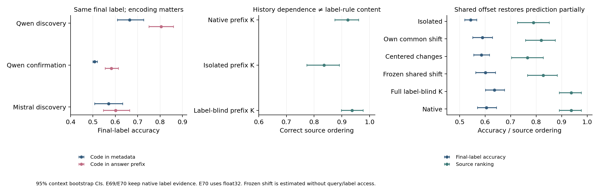
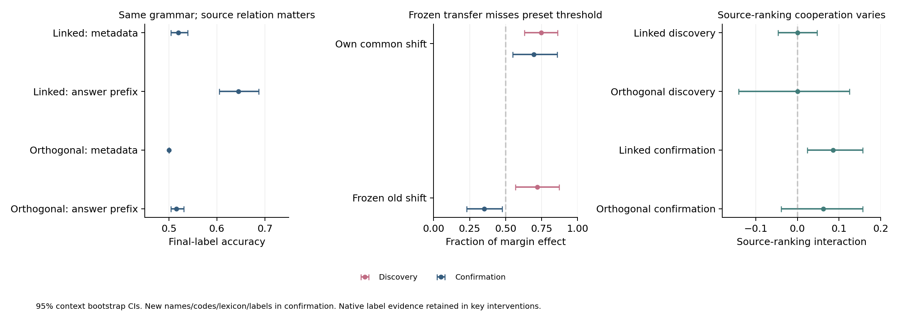
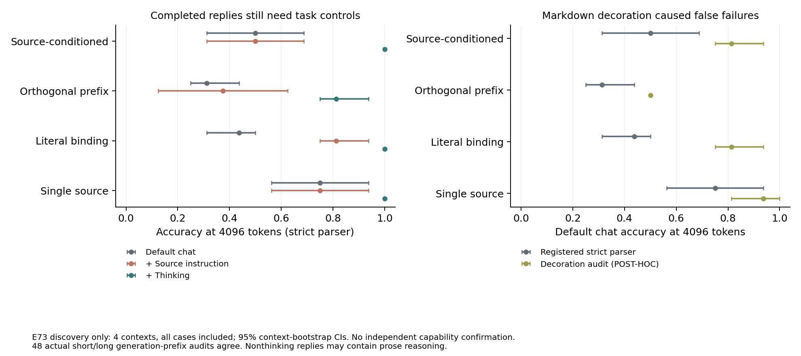
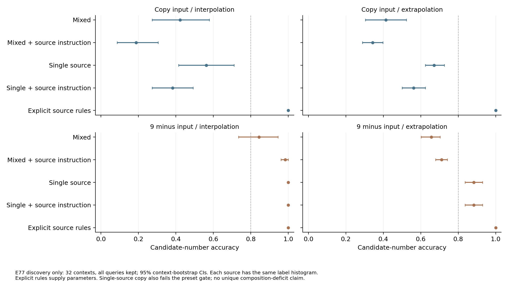
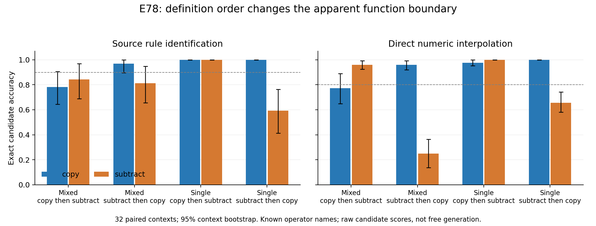

# ICES：从“默认不用来源”转向query内部的条件化计算（2026-10-10）

**agent解释草稿，论文形态与scientific-yield由人判断。**

**结论：有新的可检验切口，但重要计算规律与强论文贡献均未建立。** E58–E64实质性限制了旧解释。最值得追的是：来源条件化如何在query内部形成，不同模型为何把label读取放在不同阶段，后续读取又怎样处理已经形成的条件规则。它不要求未来模型继续答错；但“有多个计算阶段”本身已有充分文献，不能直接作为novelty。

人已授权继续探索；正式ACTIVE-EXPLORE状态保持。本次没有重写论文、增加adapter训练或作开关线决定。34个预定完成运行约0.904单卡进程墙时折算GPU·时；两次作废完整运行0.027，另有未计时的启动失败/极性中断与模型NVMe staging。该数字不是GPU利用率积分。

## 1. 最重要的数字（先看独立确认）

对同一context，交换demo来源名字位置的K，观察native输出的source-correct label margin变化；然后在干预运行中将指定attention消息替回base运行的消息。

| 材料与模型 | 只冻结**答案末位**label消息后的效应余量 | 冻结**整个query**label消息后的余量 | 两scope配对差 |
|---|---:|---:|---:|
| Qwen3-8B，独立synthetic词库，n=64 | 0.471 [0.438,0.508] | 0.061 [0.027,0.094] | 0.410 [0.373,0.450] |
| Qwen3-8B，独立真实评论池，n=48 | 0.527 [0.476,0.581] | 0.054 [0.001,0.102] | 0.473 [0.426,0.525] |
| Mistral-7B，synthetic同材料复现，n=64 | 0.127 [0.089,0.165] | 0.078 [0.040,0.113] | 0.049 [0.033,0.065] |

方括号为按context bootstrap的95%CI。**这是指定干预的平均logit效应比，不是准确率、来源保留率或可加的因果份额。** 真实评论采用E56的race/gender受控反转规则，不是自然标注者ground truth。完整source-K效应分别为2.040、0.569、0.441 nats（原始CI见JSON），仍须区分弱signal与稳定任务能力。

两scope的base/sourceK原始输出逐位相同；原生attention×V×O重建RMS、no-op和all-attention-output冻结误差全为0。这个差异因此来自干预范围，不是更换模型、数据、seed或数值实现。

**现在能够说：** Qwen的来源影响很大部分依赖答案前query位置的label消息；Mistral的label消息更集中在最后位置。两模型的source-name消息在只冻结最后位置时几乎不受阻，扩到全部query时来源效应近0。

**不能说：** source binding已完整完成、已经发现新head/新算法、末位label读取必然破坏正确规则，或所有模型共享这条时序。E64是message依赖对照，具体source→query field→label→answer path还没有定位。

## 2. 实验怎样逐步改变问题

| 实验 | 为什么做 | 哪个判断改变了 |
|---|---|---|
| E58：平衡2×2，source名字双胞胎差分，跨label probe | E56c的失败是否支持source×label合取 | 存在可迁移common source成分；不是“只能合取”。真实残差cross0.992–1.000，但相关K/V较弱/不对称；差分probe不是native单次部署 |
| E59：source-swap vs label-flip，各位置K/V交换 | label上probe到source是否定位自然source使用 | source-name K承担约0.82–0.97的source效应，label-anchor KV主要承担mapping；“source默认不用”错误地只看了label锚点/末位 |
| E60：同任务两词表，跨词表name-K移植 | 词表是否直接改变source选择程序 | 没有有效转移。synthetic词表性能差很大、single参照也差；real不复现大差。不能将换词涨分或E56c迁移失败单独归因路由 |
| E61：source-K×label-V/KV双翻转 | 两种影响分别存在是否证明可组合 | 纯V版本不能恢复，label K+V显著改善；非加性存在，但不等于完整可分离构件，也不支持普遍“绑定与ICL不能组合” |
| E62：同三元组，source移到label之后 | carrier是output identity还是信息完成的位置 | 部分mapping影响移向source位置，但预测未改善，real转移弱；拒绝“末字段唯一carrier”与“换位置就修复”的捷径 |
| E63：冻结末位label消息 | source key的作用是否经label重新读取传递 | Qwen仍保留约50–69%，但只能说末位范围不完整；首轮分解重建失败VOID，修为原生权重后重跑 |
| E64：配对扩至全部query | E63剩余是后续读出调制还是提前读取 | Qwen剩余降到约5–6%；Mistral主要在末位。研究对象从末位检索扩到query内部的计算分工 |

每卡均有跑前问题/对照/决策表；没有用完整结果改主要读数、筛seed或排除坏答复。发现、确认词库独立；真实文本train/test pools独立。模型只有Qwen3-8B和有界Mistral复现；并未把增加模型数量当作认识升级。

## 3. 哪些旧表述必须收窄

1. **“有来源信息，默认不用。”** 可读出与使用不同，但E59/E64已经直接测到native使用。准确说法是：label锚点的source表示不充分定位source计算，末位attention也不充分代表整段query的条件化过程。
2. **“按output索引是唯一机制。”** 作为部分通路的描述有证据；整体程序包括名字K与query内部消息，不能用单一机制吸收这些反例。
3. **“E56只打开了一个小开关。”** 它在20层各训练rank8，总计1,310,720权重；single-source是参照，不是能力上限。它可学习额外任务计算。
4. **“E56c证明没有通用source方向。”** 数据、任务与词表同时变；只能说这个模块的迁移有限。E58的common source差分也不反过来证明完整独立绑定。
5. **“多人ICL不能工作／现象显著故后果大。”** E50–E52仍是必须保留的边界。新增干预并未推翻其实际预测结论。
6. **normative与规律。** exact Bayes oracle只在指定noise/change生成模型下精确；E02不证明一般不理性。E33有强关联，但有限词表及预训练用途、tokenization、输出几何仍限制“普遍语义定律”的因果解释。

C09/C10/C12/C13的有界证据保留；C14/C15/C16新增L1，没有升L3或宣布完整机制。原论文形态卡/10-09复盘保留并标解释校正。

## 4. 对最强已有认识的定位

- [Cho ICLR2025 §5.2](https://arxiv.org/html/2410.04468v3)：已有parallel circuits、direct decoding、forerunner shortcut。ICES不能只因发现另一token位置或query早期活动就称新机制。
- [Cho ICLR2026](https://arxiv.org/html/2509.21012v2)、[NAACL2025](https://arxiv.org/html/2406.16535v3)：task-verbalization、信息过滤与token读出边界已被研究。训练小模块、换词改变准确率不是中心新发现。
- [CBR ACL2026](https://arxiv.org/html/2604.19052v1)、[Mixing Mechanisms](https://arxiv.org/html/2510.06182v2)：双键关系绑定及多种检索机制已有所有权；“之前只做单键”撤回。
- [Test, then Route](https://arxiv.org/html/2608.04183v1)：predicate已被定位在query-digit位置，随后传到末位；router依赖label pair。**提前在query计算**与**跨词router失败**不是空白。
- [Few-Shot Examples Add Up](https://arxiv.org/html/2605.16591v2)：已有QK/V因果分解和context reweighting。二者不同、存在交互不是ICES自己的贡献。
- [Lepori ACL2026](https://aclanthology.org/2026.acl-long.676/)、[更新失败](https://arxiv.org/html/2609.38866v1)、[Decodable State](https://arxiv.org/html/2609.31401v1)：表示可读出、native选择与外部修复需要分开。Lepori本轮只核对摘要，全文细节未核对。

论文卡与过程参照在`library/themes/in-context-evidence-structure/KEY_PAPERS.md`；venue corpus、awesome/master与DailyArXiv均扫描过。没有exact-collision判决，没有因邻近工作关闭题目。

## 5. 四层判断与真正值得继续追的分支

| 层次 | 更新后的判断 |
|---|---|
| 空间 | 有意义的对象是metadata-conditioned规则学习的**完整query程序与机制选择**。它已有强近邻，不能靠“没人做过双键”立题 |
| 线索 | 更强且更克制：common source差分、变量特定位置、query内部消息与家族时序差异形成了可继续测的链条 |
| 主张 | source确实被native使用；Qwen末位诊断会漏掉大量label消息中介，Mistral的label时序不同。准确head/path、充分绑定和最后阶段的稀释仍未知 |
| 贡献 | 目前是新的测量切口和范围修正，尚未达到统一预测理论或令人信服的强论文增量。不能把纠正自己的旧叙事直接等同改变整个领域认识 |

更好的问题候选是：**来源条件化在query内部的哪些位置形成？哪些信息已经被组合，哪些还需后续检索？模型为何选择不同的label读取时序？最后的label读取何时增强、何时稀释已有的条件规则？**

后续算力只优先给三件能改判断的动作：按query字段作path接力干预；将两阶段/多机制模型与单一joint-kernel/label-bias解释竞争，用独立布局预测比较；在预测明确后用少量强模型与reasoning检查程序改变。若最终只是已有shortcut/lexical binding的直接实例，就如实保留为有界分析，不用更多配置强保故事。是否形成新中心贡献、缩成有限论文或改变投资，由人判断；本次不作关闭/暂停决定。

## 6. 复算、失败与资产

- 小汇总：`results/e58_e64_summary.json`；E58各`analysis.json`；E59`mediation_analysis.json`及real `probe_analysis.json`；E60–E64各`analysis.json`。原始context/逐条分数/锚点数组留NFS，不入git；所有运行seed、n、script hash与model origin记录在卡/README/run.json。
- 两次E63外部SDPA消息重算最大relative RMS=0.0723超过0.02阈值，标VOID、保留目录；改原生eager权重后全部重建为0。E59第一real极性不一致运行完整汇总前中断、同seed重跑；E64缺少导入的启动失败没有科学读数。
- `.py`编译、34个预定完成运行的行数/target平衡/控制/分析完整性核对通过；两scope native逐位相同由分析脚本强制assert。正式独立科研校对尚未完成，bootstrap只覆盖contexts。
- 科学结果没有因好坏筛选；工程作废不混入有效结果。完成后本地/远程GPU均释放；研究状态未改变。

## 7. E65–E66继续更新：relay不等于可复用规则（2026-10-10）

E65的sender-edge干预进一步确认query→answer接力，但**位置有模型差异**。Qwen独立synthetic确认，冻结Label标记消息后的source-K效应余量0.226[0.172,0.285]，真实评论确认0.065[-0.016,0.138]；全部query relay余0.021/-0.013。Mistral同synthetic材料marker余0.947[0.930,0.963]，source字段余0.051[0.033,0.068]。不能把一个位置上的统一解释推广所有模型。

删除末位demo标签读取在Qwen中增大gold-aligned平均logit交互，却没有稳定的准确率修复；发现合成-8.6点、独立确认+3.5点、真实评论确认-2.3点（CI跨0）。Mistral margin/accuracy均受损。POST-HOC分解发现删除还显著扩大bias/main effects，synthetic确认同input的source排序正确率反而下降3.9点。**“改进某个来源评分读数”并不等于“source选择改善”；不能将它写成修好了binding。** 分解使用评测材料，是解释线索，不是独立校准证据。

新增强近邻[Performance-Critical Tokens](https://arxiv.org/html/2401.11323v4)早已检验模板信息汇聚；[Just-in-time task representations](https://arxiv.org/html/2509.04466v3)早已区分identity解码、可迁移任务状态与瞬时时序，且input前位置也有部分迁移。E65的模板relay、E66的接口失败都不能直接命名成新计算原则。与Cho shortcut/FV的距离仍需落在**更具体、可预测的条件规则选择**上。

E66据此拆开两种状态：输入出现前形成的source-clause全层KV，和已看过输入的query KV。首轮bf16分段no-op max1.625nats，超过预设0.10，VOID保留；改float32同seed后max4.01e-5、屏蔽demo attention质量0。发现集source-clause与null差-0.010[-0.138,0.107]nats，**单来源接口也失败**；answer relay比null+1.050[0.829,1.279]nats、accuracy+18.8点。仅支持这个cache接口能传递input-dependent判断，不支持source-specific独有组合缺陷，也不证明模型不存在可复用function state。独立确认来源clause−null margin−0.109[-0.202,−0.010]nats，single同样无效；已见input的query缓存margin+1.109[0.861,1.369]、rule donor1.919[1.521,2.287]，但accuracy仅+3.9点（低于预定5点MIE），不复现发现的18.8点。只支持规则相关logit传递，尚无完整可部署程序。有效推断为float32，精度范围不能忽略。

**科学判断：** 这轮继续排除了过强解释，测量变得更准确；尚未得到能预测新场景的中心理论。不要将“不断定位到新token”作为默认投资方向。下一轮优先竞争两类解释：输出表示如何改变证据选择／读出，和来源条件化如何形成可复用任务计算。每类都必须先写出对独立信息等价编码的不同预测；否则再多token实验也可能只是已知电路的实例。现象有界可靠，不据此桌面宣布项目trivial或自动强保。

## 8. E67–E70：从“output-indexing缺陷”推进到可检验的状态作用分解

**这一轮产生了更具体的知识增量，但仍未建立普遍规律或完整Source条件化模型。** 新切口是：contextualization究竟改变了组内样例的可区分性，还是改变了某类载体能否被读取？历史访问的必要性、状态包含当前规则、干预恢复预测是三个不同判断。

| 实验 / 为什么现在做 | 独立确认数字 | 实际改变的判断 |
|---|---|---|
| E67：同input/source/最终label，交换Tag字段与答案prefix的code；token多重集、词频、位置严格配对 | Qwen accuracy0.508→0.582，差+0.074[0.047,0.105]；Source排序0.805→0.914，差+0.109[0.055,0.172]；label-only KV只转移约8%的固定Q格式gap | 相同最终label word不是分隔失败的充分条件；但完整输出grammar/namespace仍改变，不能称“全部输出身份一样”。Mistral matched accuracy差CI跨0，不能普遍推广 |
| E68：仅prefix状态移植为demo-isolated，保留label证据；另交换label-history donor | isolated prefix KV损害accuracy7.8点、排序13.3点；label-flip prefix KV仅约1.3%的完整rule响应 | 历史上下文化必要，但不能因此说prefix已存先前任务的label判断；位置必要≠内容定位 |
| E69：全label列禁读，禁止任何非label中介偷读历史label | blind prefix K保留accuracy/Source排序；blind−isolated排序+0.102[0.031,0.172]；所有非label KV对label-flip逐位不变 | 指定prefix K的历史作用不需label内容；其它native状态/labels仍可提供任务知识，不能说整个ICL无标签学习。V/KV/joint的等效界更弱 |
| E70：label-blind−isolated K差分拆shared mean与centered变化，再冻结发现均值跨词库/label迁移 | shared mean恢复0.527[0.274,0.760]的blind−isolated margin效应，accuracy+0.059[0.023,0.094]；固定Q组内logit spread<4e-6 | 不必把所有history损失解释成每条demo地址被重新写入；可迁移的公共group prior也参与。但shared Source排序0.828<原生0.938，预测恢复不定位完整Source binding |

E70的mean逐层逐head共享于所有demo prefix keys。对固定query，给一组keys加相同向量只增加同一个QK logit常数，不改变这一组内部的相对匹配，而会改变它与其它token组竞争的attention质量。完整程序仍可能改变后续Q及label读取，不能从这个数学事实推出整个检索分布不变。偏移有36×8×128个数，不是“全模型一维向量”；没有训练，且由未读label、未见query的发现状态取均值构造。

**不能把部分恢复升级为唯一机制。** E70 own common在独立确认只恢复62%的平均效应，Source排序恢复不显著；centered单独弱，完整blind K却恢复原生排序。common×centered的Source排序交互在确认中为+0.141[0.063,0.227]，但此读数是POST-HOC，须新样本预定确认。当前更合理的是保留group access与个体matching协作的候选，而非宣布“只有一个公共开关”。

### 最强近邻之后，什么仍有机会成为贡献？

[Cho的shortcut](https://arxiv.org/html/2410.04468v3)已经提出前demo可当query、forerunner可复制已有计算；[Few-Shot Examples Add Up](https://arxiv.org/html/2605.16591v2)已有contextualization、QK/V分解，附录K明确非原任务的Q也能维持有效alignment；[PCT](https://arxiv.org/html/2401.11323v4)、[just-in-time状态](https://arxiv.org/html/2509.04466v3)也已限制简单label位置/持续task-vector解释。因此，group历史依赖、label-independent alignment和共享状态的存在本身均不是空白。

更具体的候选贡献是：**区分context-dependent key alignment中的载体组可读性、组内匹配与label知识，用信息隔离＋数学不变性＋未见材料的冻结状态迁移，校准通常混在一起的机制推断。** 同时追问这些条件为什么随schema编码改变。它有一座可测的桥，而不依赖未来模型继续答错；但它尚未解释原ICES的所有现象，也未预测足够多的新schema/模型。不能仅凭这四张卡确定强论文已成立。

| 层次 | 当前判断 |
|---|---|
| 空间 | 关键未知是context如何改变计算的可访问性与变量作为检索key的方式；与既有ICL alignment/TVS/binding研究有强交集，不能以“没人做过”立题 |
| 线索 | 同信息编码、label-blind状态、公共key平移、独立冻结迁移形成了可继续探索的链条；纯label-anchor/缓存位置定位都不足 |
| 主张 | C17–C19全部L1，有清楚的接口/精度/名字/词库边界；恢复accuracy不等于恢复Source排序，更不等于在干预位置学了完整rule |
| 贡献 | 从具体失败向测量与计算作用的区分推进了一步；尚缺新的schema/身份、独立强模型、native完整路径与定量行为预测。当前不能宣布重要计算规律已建立，也不据此关闭项目 |

优先下一动作：检验group-prior解释对未参与发现的schema/code identities的预测，并与组内matching合作作新预定验证；再比较少量有代表性的强模型/不同task程序。自然多标注者损失与frontier reasoning的压力测试仍未完成，不用代理分数/合成toy替代。所有固定偏移只是机制工具，不重写成无代价修复方法。

### 校对与资产

E70 bf16首轮common写回造成fixed-Q组内spread0.06986>预定0.02，VOID保留；float32同seed重跑及确认通过。E67–E69原生缓存/no-op/隔离/盲化控制全0。新独立确认seed167001/168001/169001/170001均跑前定义，不筛seed/答对实例。小JSON、图、代码入git，raw JSONL/布局/frame.npy留NFS；摘要`results/e67_e70_summary.json`。正式独立科研校对未完成，不升L2/L3，不改ACTIVE状态。

## 9. E71：关系信息的确认与通用frame预测的失败

**本轮前缀关系效应复现，但通用冻结状态的预测失败；这两件事必须一起报告。** 独立新名字Alice/Bob、码词Left/Right、词库与toxic/safe标签的64contexts中，linked的metadata→prefix accuracy0.520→0.645，而orthogonal0.500→0.516。relation×layout accuracy+0.109[0.070,0.152]、margin+0.514[0.427,0.597]；来源排序交互CI跨0。两个relation都保留真实Source，答案namespace、码词频率、token多重集/位置相同，但code是否提供冗余关系不同。因此单纯扩大输出语法不足以解释E67式收益；这只是具体的关系条件，不证明新binding构件。

旧E70 frame在新发现Red/Blue上转移72.0%[57.0,87.1]margin效应、accuracy+12.5点；确认只剩35.0%[23.1,47.7]、accuracy+3.1点，来源排序无改善，**低于跑前50%/5点门槛**。新context自己的common成分仍恢复69.5%[55.0,85.8]margin、accuracy+6.3点；不能把两者一起写成普适的独立路由开关。确认同时换四类材料，不足以单独判断失败是名字、码词、输入还是最终词表导致。

预定common×centered来源排序交互在确认+8.6点[2.3,15.6]，为E70事后线索提供新材料有界支持；发现交互0且原生排序饱和1.00，确认accuracy/margin交互CI跨0。它支持保留group access与matching协作的候选，尚非普遍理论。code冲突query只作cue诊断，不作为能力错误：Source与code冲突时默认解读有歧义。

重读[Contextualize-then-Aggregate](https://arxiv.org/html/2504.00132v2)发现该文已因果区分domain/identity/function，部分context边传空间而非rule，不能把E69的label-free历史作用本身当novelty。[Cho审稿过程材料](https://www.hakaze-c.com/reviews/hidden_calibration)进一步提醒：几何图若只重复accuracy没有自动增加解释，额外监督与信息预算必须公平。这里的增量只能是明确的新关系条件与可失效的预测；完整算法与强模型边界仍缺。

### E72仍运行：先识别接口/预算限制

Qwen3-8B与较新Qwen3.8-27B用相同8-context pilot，对比raw、native chat、Source指令及thinking，包含single与字面entity-binding阳性。新27B权重完整、无missing language keys；conda openslime＋vendor transformers（具体版本待run.json），NVMe暂存718.204s，不计科学GPU时间。两模型同开发者家族，不能替代独立frontier压力测试。

8B的raw/chat候选评分已完整、no-op/token sum控制0；但native direct96-token生成大量截断，甚至single/entity阳性也受影响。查看样例发现关闭thinking后仍自然写长分析，故该模式的低生成accuracy不能定位Source binding。原输出保留；需要先做预算匹配/有效接口验证，不能用固定短回复制造强模型失败。2048-token thinking与27B运行仍未终止；完成前不报最终能力结论，不升级主张。

更有信息量的后续候选是：**正确Source×label组合在demo中缺失、但label全局出现时，模型是在做正向支持检索，还是能从指定函数约束及排除证据推出标签？** 这与Cho unseen-label和Incomplete ICL有强近邻，不能泛称首次研究缺标签。若继续，必须明确bijective函数假设、对比不施加该约束时的不可识别性，并拆开pretrained语义与新映射推断；本轮尚未运行，不能作为结果。

## 10. E72/E73完成：先纠正能力测量，再推进新的反事实

**新27B的有效推理接口可以解决普通来源任务；本轮不能支持强模型绑定能力缺失。** E72每模型640候选评分＋480生成全保留、no-op/token重建误差0。Qwen3.8-27B thinking2048在8-context source_only、linked、字面entity、single全对；orthogonal仅.4375，但56.25%回复尚未完成。direct96在27B的所有schema全部截断，8B的single/entity正控也失败。低生成分数主要包含接口/预算混杂；raw/direct/think不可当同一能力指标。

E73对固定前4contexts跑192条4096-token轨迹，预定48次真实short重跑逐token前缀核对全一致。orthogonal thinking在**同一采样轨迹**2048→4096 accuracy .1875→.8125，截断.8125→.0625。长预算thinking source_only/entity/single全对，instructed chat source_only .500、single .750，后者低于预定.80阳性门槛，**不触发原卡独立能力确认、不定位多来源特有组合缺陷**。

查看已完成却解析失败的回复又发现`**Answer: yes**`等被严格parser漏掉。这是测量遗漏，必须明确校正。保留原strict主读数；统一的装饰校正只接受独立Answer/Final Answer行、不捞正文标签、不剥`Red yes`复合code、不按gold挑答案，结果标POST-HOC。校正后的8B默认chat4096 source_only .8125[.750,.9375]、entity .8125、single .9375，而Source指令仍分别.500/.875/.750。未确认的方向性线索是**显式指令并不自动激活更好程序**，不是模型没有来源信息；关闭thinking模式也会写自然语言分析，不能将其视为无推理预算。

### 科学问题的下一切入点

E74不是再扫模型：让正确标签在其它来源的真实records中出现，同时让该Source×category组合没有示例。给定source-specific双射时，自己的其它类别可成为对已用标签的反证；独立函数假设下则不可识别，oracle输出Unknown。同步交换两个source的label保持全局频率，令约束补全与固定非负label-support预测相反。但**同步正响应还可能来自互相借用标签**，所以加owner-only＋补偿、foreign-only swap/cycle及补偿-only对照；四source均满足所声明的函数，不用矛盾假数据制造反常。

E74已完成36contexts：full目标/seen100%，held bijection .3194[.2361,.4028]→Source指令.3611[.2778,.4444]；同步signed response−.5163[−1.1777,.1046]、owner响应CI也跨0。方向略偏正向支持，但未过MIE，不触发72-context确认。held independent Unknown accuracy0；即时输出未按函数空间执行，故不能直接宣布模型不会约束补全。E75在18新contexts用原生thinking先验证full/held bijection与held independent三个有效性条件，parser与门槛已先冻结，未读取终点。

更深的候选是：**从哪个来源读到答案词，不必等价于根据哪个来源的映射关系决定答案。** 这针对E48式foreign-label贡献的解释桥，尚无新因果结果，不降级其真实读出测量，也不宣布新认识已成立。即使E75成功，仍可能是Cho/Incomplete ICL已描述的排除计算；Mixing Mechanisms已区分指针/已取回答案，Test-then-Route已拆predicate/word routing。ICES需要自己的source-local关系反事实和独立预测，才能跨过贡献门槛。

### 当前投资判断

空间仍存在：来源条件化、函数约束与词实现的组合何时发生；线索已从“在但不用”变为多位置条件化和强接口可解任务；主张只支持有界路径/关系效应，未有完整机制；贡献仍不确定。继续投资应由这些新反事实能否把关系使用与词读出分开决定，不能以旧模型失败、已知patching限制或新几何图当科学增量。C17/C19仍L1，ACTIVE状态不改。

## 11. E75–E77：科学更新包括纠正我们自己的“阳性”解释

**原生Source约束补全可以完成，而Source相关效应不证明完整Input×Source函数。** E75的18新contexts、108回复全保留；full/held双射各36/36正确，独立函数24/36正确Unknown、另12未闭合，不能将截断视为错误推理。严格与装饰parser相同，不是再修parser得到阳性。Source closure在此接口有效，完整三条件gate仍受预算限制；不是新机制结论。

### E76：复现了方向，却没有复现高准确率；发现了任务捷径

±1任务的发现Source准确率.828/.844，正确目标值未在自己的label里出现；新名字/20–29数字确认只.688/.734，**没有过预设.80**。同步Source响应仍3.648[3.403,3.883]nats、owner-minus-comp约1.86；说明正确方向不是巧合，但不是完整高效程序。完整前向逐token审计与cached方法max误差<4.2e−5，排除评分快捷方式的数值错误。

随后审视设计发现：未见query永远是两训练input的中点，平均Source的label就等于gold，甚至不需要使用query Input；x+b本身还是加性主效应。**此前将此阳性说成真正函数/能力组合过强，现在撤回。** 已有方向和候选准确率事实不作废；Source“被用”与“以正确程序被用”必须分开。双位数的完整值未见也不代表所有组成token只在foreign source出现。没有用原阳性强推word-copy解释。

POST-HOC成对分解显示确认Source排序1.00、Source对却有53.1%都选同一合法±1结果，c/s阈值可解释accuracy与排序分离。这不是可部署校准，不说明函数学会；没有据事后分解改主读数。下一任务排除Source均值后再研究function。

### E77：完全相同的label边缘，区分事实检索、函数推断和已知规则执行

每Source Input2/7和Label2/7频率完全相同，只有对应关系决定copy或9−x；同一context测试全0..9 Input，Source常量/均值不能给出正确函数。Direct-rule table100%正确说明模型能在此接口绑定已给参数并执行。Mixed novel弱，Single−Mixed插值+14.8[2.0,27.0]点/外推+24.2[17.2,31.3]点；但Single identity插值.563/外推.672也未过.80，**不能归成独有多来源组合缺陷**。

两operator的不对称很强：Single complement插值1.00/外推.883，identity更弱；Source一句指令把Mixed complement插值升到.984，却把identity降到.188。错误签名（POST-HOC）中，Single identity的98/256错误全是另一个合法operator的答案。这里不能只重复“来源不区分”，也不能把Source指令当统一开关。

新的辨别问题是：**模型是否识别错了每个Source的function identity，还是识别之后没有在数值预测中调用？共同的operator偏好、函数描述顺序与Source cue出现位置能解释多少？** 目前没有rule-ID判断或内部表示证据，不能先写“知道却不用”。下一轮应让这几种解释竞争；暂缓基于未确认完整函数行为的foreign-word机制。

### 与更强近邻对齐

新读Yang/Cho/Inoue [Localizing TR/TL](https://arxiv.org/html/2509.24164v2)的定义、channel消融、层序与H.4。其TR明确指label-space recognition，不等于这里识别copy/complement哪种函数；其composite实验Country–Capital→Antonym是不同输出label空间的串行任务，不是同一数字空间的Source-conditioned functions。该文已经区分task-space alignment和mapping discrimination、指出不能把TL/TR发生顺序按字面算法阶段理解；“TV只支持下一任务/下一token”的桥也已有所有权。ICES不能将未来operator识别/应用的差简单改名TR/TL novelty；必须有实际Source条件与可反驳的因果预测。

**四层判断仍克制：** 空间是多个contextual keys怎样选择/部署已知或推断的函数；线索是Source方向、native补全、函数类别不对称与Direct/Infer差；主张只包含上述有界事实，平均标签、task/function偏好、查询语法与计算部署都是竞争解释；贡献仍未建立。识别捷径/排除错误叙事是研究进展，但纠正我们自己的解释不是自动的领域贡献。没有把项目判trivial，也没有因新实验多就确信强论文；不改ACTIVE/I04，所有新主张仍L1或更低。

## 12. E78：强描述顺序效应先于函数部署解释

**新结果改变了对E77的判断。** 32个新context、四Source独立copy/subtract，只交换完整函数定义块，mixed/Input-first插值subtract .9609→.2500，copy .7734→.9609；word频率不变，seen .9961几乎全对。copy-minus-subtract偏好变化+.8984[.7284,1.0821]，single亦+.3672[.2812,.4467]。E77的identity劣势不能当稳定函数类别/Source组合结构。见E78与`results/e78/qwen3_bridge/analysis.json`。

模型自选code相对空Rule字段mixed插值+.1895[.1016,.2637]、外推+.2441[.1680,.3125]，但Rule-ID两函数.8750/.8281未过.90，single gold-copy外推.8945亦未过执行阳性。Source-before-Input直接反而损害约8.6–8.8点，Source一句指令无稳定恢复。不宣称可靠知道而不部署，不铺该线路内部patch；严格保留失败gate与全部Source/code错误传播。

**近邻更直接。** 本轮深读[Liu/Neubig/Andreas COLM2024](https://arxiv.org/html/2404.03028v3) §2–5：rule inference、few-shot预测与rule following分离，并把self-inferred instruction回交执行，已拥有一般认识。[Fu等2609.03213v1](https://arxiv.org/html/2609.03213v1) §2–4/B.3已有rule/examples比较，并提醒不同机制不推出combined收益。单纯再报识别/应用gap或code涨分增量小；两篇独立论文卡记方法/覆盖范围/距离，非自动关线。JIT的接收状态第三方与corpus不一致，暂只称预印本，机制仍是强近邻。

**下一可测桥（还不是结果）：** physical foreign label对输出的贡献，是否必然表示采用foreign的函数参数？E79先构建可唯一识别的private函数theta＋共享输出codebook g：自家Source只见2/7，novel正确Word只在foreign labels，Casey公开identity让g可由完整records推断。改变own theta与改变g都能产生同一目标Word翻转，两者一起取消；另foreign私人theta变化应不改自家答案。先过behavior/direct阳性再分解messages。共享字典逻辑反例本身不新，若只跑通任务增量仍有限；需要模型实际计算的分解及对旧测量的预测才会提高研究意义。

所有新事实L1/诊断，无C##升级；项目意义仍未定，不因涨分强保故事，不把发现自己的格式混杂当领域贡献。

## 13. E79：词典读取阳性不保证复合执行，暂不作provenance归因

[E79](experiments/E79-parameter-evidence-versus-codebook-evidence.md) 在16新context拆开private函数theta与shared codebook g；C已知copy使任务唯一可识别，两定义顺序等权、全部真反事实保留。四接口词典lookup约95–99%、seen近全对，但direct真实规则的subtract插值21.9%[6.3,38.9]、外推15.6%[6.7,26.4]，没有足够执行阳性。numeric原子F在同context尚未测，不声称原子可靠却无法compose。

Mixed own-source signed响应有正CI，但lexical/foreign_D响应CI宽；后者不满足±.5nats等效界，不能报“foreign规则无影响”。own+dictionary的foreign_D零效应由D根本未进入prompt保证。事后错误签名direct subtract151/256输出g(x)、48正确、57其它，符合跳过变换的输出形态，但没有内部时序证据。bool准确率相减的分析错误已修，仅改float转换；科学评分和跑前读数不变。结果`results/e79/qwen3_codebook/analysis.json`，no-op0、24次cache/full-forward最大5.82e−5，429.0415s=.1192GPU·时；无升级、无后续GPU运行。

## 14. 人纠偏后的综合与投入排序

完整综合见[`RESEARCH_SYNTHESIS_2026-10-10.md`](RESEARCH_SYNTHESIS_2026-10-10.md)。我把局部探索控制逐渐变成整条研究的新门槛，导致从原来源条件化漂移到越来越多函数/词典有效性问题。纠正混杂不要求研究解释所有新任务；本次先总结和上传main，不执行未启动的E80，也不把E79后续控制排在主线之前。

优先链条回到E59–E71：来源参与native计算；whole-query介入改变中介判断；关系×位置影响分类；公共prefix载体组key偏移可恢复预测却未恢复同等来源排序。E71新身份35%[23.1,47.7]恢复及+3.1点[0.8,5.5]准确率虽未过原MIE，仍是正的部分迁移。原主张等级不变；这些结果值得先综合成有界解释，不等于已拥有新完整电路，也没有理由因此把项目判trivial。

下一步只围绕载体可见性与组内来源选择的区别：先整合现有数据，再考虑在E67/E71分类schema匹配载体组attention总量的单个pilot，分开测预测和来源排序。具体干预需跑前卡限定范围；不承诺全网完全隔离、不先铺任务/模型扫描。其失败只影响该解释与操作，不成为项目新门槛。ACTIVE/I04与最终scientific-yield决策权限不变。
