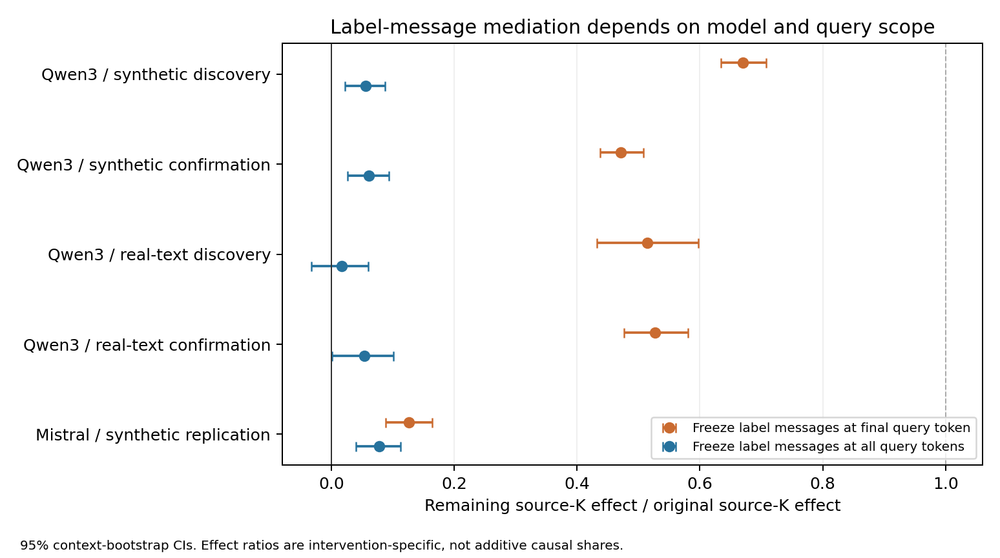
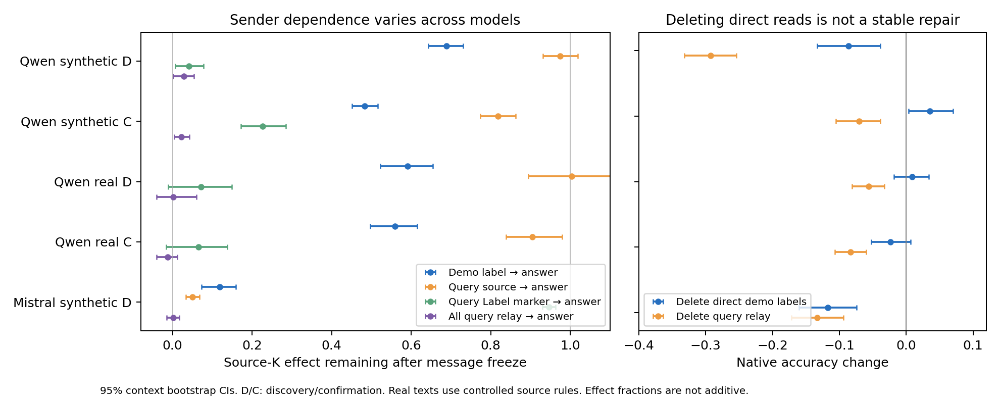

# ICES：从“默认不用来源”转向query内部的条件化计算（2026-10-10）

**agent解释草稿，论文形态与scientific-yield由人判断。**

**结论：有新的可检验切口，但重要计算规律与强论文贡献均未建立。** E58–E64实质性限制了旧解释。最值得追的是：来源条件化如何在query内部形成，不同模型为何把label读取放在不同阶段，后续读取又怎样处理已经形成的条件规则。它不要求未来模型继续答错；但“有多个计算阶段”本身已有充分文献，不能直接作为novelty。

人已授权继续探索；正式ACTIVE-EXPLORE状态保持。本次没有重写论文、增加adapter训练或作开关线决定。34个预定完成运行约0.904单卡进程墙时折算GPU·时；两次作废完整运行0.027，另有未计时的启动失败/极性中断与模型NVMe staging。该数字不是GPU利用率积分。

## 1. 最重要的数字（先看独立确认）

对同一context，交换demo来源名字位置的K，观察native输出的source-correct label margin变化；然后在干预运行中将指定attention消息替回base运行的消息。

| 材料与模型 | 只冻结**答案末位**label消息后的效应余量 | 冻结**整个query**label消息后的余量 | 两scope配对差 |
|---|---:|---:|---:|
| Qwen3-8B，独立synthetic词库，n=64 | 0.471 [0.438,0.508] | 0.061 [0.027,0.094] | 0.410 [0.373,0.450] |
| Qwen3-8B，独立真实评论池，n=48 | 0.527 [0.476,0.581] | 0.054 [0.001,0.102] | 0.473 [0.426,0.525] |
| Mistral-7B，synthetic同材料复现，n=64 | 0.127 [0.089,0.165] | 0.078 [0.040,0.113] | 0.049 [0.033,0.065] |

方括号为按context bootstrap的95%CI。**这是指定干预的平均logit效应比，不是准确率、来源保留率或可加的因果份额。** 真实评论采用E56的race/gender受控反转规则，不是自然标注者ground truth。完整source-K效应分别为2.040、0.569、0.441 nats（原始CI见JSON），仍须区分弱signal与稳定任务能力。

两scope的base/sourceK原始输出逐位相同；原生attention×V×O重建RMS、no-op和all-attention-output冻结误差全为0。这个差异因此来自干预范围，不是更换模型、数据、seed或数值实现。

**现在能够说：** Qwen的来源影响很大部分依赖答案前query位置的label消息；Mistral的label消息更集中在最后位置。两模型的source-name消息在只冻结最后位置时几乎不受阻，扩到全部query时来源效应近0。

**不能说：** source binding已完整完成、已经发现新head/新算法、末位label读取必然破坏正确规则，或所有模型共享这条时序。E64是message依赖对照，具体source→query field→label→answer path还没有定位。

## 2. 实验怎样逐步改变问题

| 实验 | 为什么做 | 哪个判断改变了 |
|---|---|---|
| E58：平衡2×2，source名字双胞胎差分，跨label probe | E56c的失败是否支持source×label合取 | 存在可迁移common source成分；不是“只能合取”。真实残差cross0.992–1.000，但相关K/V较弱/不对称；差分probe不是native单次部署 |
| E59：source-swap vs label-flip，各位置K/V交换 | label上probe到source是否定位自然source使用 | source-name K承担约0.82–0.97的source效应，label-anchor KV主要承担mapping；“source默认不用”错误地只看了label锚点/末位 |
| E60：同任务两词表，跨词表name-K移植 | 词表是否直接改变source选择程序 | 没有有效转移。synthetic词表性能差很大、single参照也差；real不复现大差。不能将换词涨分或E56c迁移失败单独归因路由 |
| E61：source-K×label-V/KV双翻转 | 两种影响分别存在是否证明可组合 | 纯V版本不能恢复，label K+V显著改善；非加性存在，但不等于完整可分离构件，也不支持普遍“绑定与ICL不能组合” |
| E62：同三元组，source移到label之后 | carrier是output identity还是信息完成的位置 | 部分mapping影响移向source位置，但预测未改善，real转移弱；拒绝“末字段唯一carrier”与“换位置就修复”的捷径 |
| E63：冻结末位label消息 | source key的作用是否经label重新读取传递 | Qwen仍保留约50–69%，但只能说末位范围不完整；首轮分解重建失败VOID，修为原生权重后重跑 |
| E64：配对扩至全部query | E63剩余是后续读出调制还是提前读取 | Qwen剩余降到约5–6%；Mistral主要在末位。研究对象从末位检索扩到query内部的计算分工 |

每卡均有跑前问题/对照/决策表；没有用完整结果改主要读数、筛seed或排除坏答复。发现、确认词库独立；真实文本train/test pools独立。模型只有Qwen3-8B和有界Mistral复现；并未把增加模型数量当作认识升级。

## 3. 哪些旧表述必须收窄

1. **“有来源信息，默认不用。”** 可读出与使用不同，但E59/E64已经直接测到native使用。准确说法是：label锚点的source表示不充分定位source计算，末位attention也不充分代表整段query的条件化过程。
2. **“按output索引是唯一机制。”** 作为部分通路的描述有证据；整体程序包括名字K与query内部消息，不能用单一机制吸收这些反例。
3. **“E56只打开了一个小开关。”** 它在20层各训练rank8，总计1,310,720权重；single-source是参照，不是能力上限。它可学习额外任务计算。
4. **“E56c证明没有通用source方向。”** 数据、任务与词表同时变；只能说这个模块的迁移有限。E58的common source差分也不反过来证明完整独立绑定。
5. **“多人ICL不能工作／现象显著故后果大。”** E50–E52仍是必须保留的边界。新增干预并未推翻其实际预测结论。
6. **normative与规律。** exact Bayes oracle只在指定noise/change生成模型下精确；E02不证明一般不理性。E33有强关联，但有限词表及预训练用途、tokenization、输出几何仍限制“普遍语义定律”的因果解释。

C09/C10/C12/C13的有界证据保留；C14/C15/C16新增L1，没有升L3或宣布完整机制。原论文形态卡/10-09复盘保留并标解释校正。

## 4. 对最强已有认识的定位

- [Cho ICLR2025 §5.2](https://arxiv.org/html/2410.04468v3)：已有parallel circuits、direct decoding、forerunner shortcut。ICES不能只因发现另一token位置或query早期活动就称新机制。
- [Cho ICLR2026](https://arxiv.org/html/2509.21012v2)、[NAACL2025](https://arxiv.org/html/2406.16535v3)：task-verbalization、信息过滤与token读出边界已被研究。训练小模块、换词改变准确率不是中心新发现。
- [CBR ACL2026](https://arxiv.org/html/2604.19052v1)、[Mixing Mechanisms](https://arxiv.org/html/2510.06182v2)：双键关系绑定及多种检索机制已有所有权；“之前只做单键”撤回。
- [Test, then Route](https://arxiv.org/html/2608.04183v1)：predicate已被定位在query-digit位置，随后传到末位；router依赖label pair。**提前在query计算**与**跨词router失败**不是空白。
- [Few-Shot Examples Add Up](https://arxiv.org/html/2605.16591v2)：已有QK/V因果分解和context reweighting。二者不同、存在交互不是ICES自己的贡献。
- [Lepori ACL2026](https://aclanthology.org/2026.acl-long.676/)、[更新失败](https://arxiv.org/html/2609.38866v1)、[Decodable State](https://arxiv.org/html/2609.31401v1)：表示可读出、native选择与外部修复需要分开。Lepori本轮只核对摘要，全文细节未核对。

论文卡与过程参照在`library/themes/in-context-evidence-structure/KEY_PAPERS.md`；venue corpus、awesome/master与DailyArXiv均扫描过。没有exact-collision判决，没有因邻近工作关闭题目。

## 5. 四层判断与真正值得继续追的分支

| 层次 | 更新后的判断 |
|---|---|
| 空间 | 有意义的对象是metadata-conditioned规则学习的**完整query程序与机制选择**。它已有强近邻，不能靠“没人做过双键”立题 |
| 线索 | 更强且更克制：common source差分、变量特定位置、query内部消息与家族时序差异形成了可继续测的链条 |
| 主张 | source确实被native使用；Qwen末位诊断会漏掉大量label消息中介，Mistral的label时序不同。准确head/path、充分绑定和最后阶段的稀释仍未知 |
| 贡献 | 目前是新的测量切口和范围修正，尚未达到统一预测理论或令人信服的强论文增量。不能把纠正自己的旧叙事直接等同改变整个领域认识 |

更好的问题候选是：**来源条件化在query内部的哪些位置形成？哪些信息已经被组合，哪些还需后续检索？模型为何选择不同的label读取时序？最后的label读取何时增强、何时稀释已有的条件规则？**

后续算力只优先给三件能改判断的动作：按query字段作path接力干预；将两阶段/多机制模型与单一joint-kernel/label-bias解释竞争，用独立布局预测比较；在预测明确后用少量强模型与reasoning检查程序改变。若最终只是已有shortcut/lexical binding的直接实例，就如实保留为有界分析，不用更多配置强保故事。是否形成新中心贡献、缩成有限论文或改变投资，由人判断；本次不作关闭/暂停决定。

## 6. 复算、失败与资产

- 小汇总：`results/e58_e64_summary.json`；E58各`analysis.json`；E59`mediation_analysis.json`及real `probe_analysis.json`；E60–E64各`analysis.json`。原始context/逐条分数/锚点数组留NFS，不入git；所有运行seed、n、script hash与model origin记录在卡/README/run.json。
- 两次E63外部SDPA消息重算最大relative RMS=0.0723超过0.02阈值，标VOID、保留目录；改原生eager权重后全部重建为0。E59第一real极性不一致运行完整汇总前中断、同seed重跑；E64缺少导入的启动失败没有科学读数。
- `.py`编译、34个预定完成运行的行数/target平衡/控制/分析完整性核对通过；两scope native逐位相同由分析脚本强制assert。正式独立科研校对尚未完成，bootstrap只覆盖contexts。
- 科学结果没有因好坏筛选；工程作废不混入有效结果。完成后本地/远程GPU均释放；研究状态未改变。

## 7. E65–E66继续更新：relay不等于可复用规则（2026-10-10）

E65的sender-edge干预进一步确认query→answer接力，但**位置有模型差异**。Qwen独立synthetic确认，冻结Label标记消息后的source-K效应余量0.226[0.172,0.285]，真实评论确认0.065[-0.016,0.138]；全部query relay余0.021/-0.013。Mistral同synthetic材料marker余0.947[0.930,0.963]，source字段余0.051[0.033,0.068]。不能把一个位置上的统一解释推广所有模型。

删除末位demo标签读取在Qwen中增大gold-aligned平均logit交互，却没有稳定的准确率修复；发现合成-8.6点、独立确认+3.5点、真实评论确认-2.3点（CI跨0）。Mistral margin/accuracy均受损。POST-HOC分解发现删除还显著扩大bias/main effects，synthetic确认同input的source排序正确率反而下降3.9点。**“改进某个来源评分读数”并不等于“source选择改善”；不能将它写成修好了binding。** 分解使用评测材料，是解释线索，不是独立校准证据。

新增强近邻[Performance-Critical Tokens](https://arxiv.org/html/2401.11323v4)早已检验模板信息汇聚；[Just-in-time task representations](https://arxiv.org/html/2509.04466v3)早已区分identity解码、可迁移任务状态与瞬时时序，且input前位置也有部分迁移。E65的模板relay、E66的接口失败都不能直接命名成新计算原则。与Cho shortcut/FV的距离仍需落在**更具体、可预测的条件规则选择**上。

E66据此拆开两种状态：输入出现前形成的source-clause全层KV，和已看过输入的query KV。首轮bf16分段no-op max1.625nats，超过预设0.10，VOID保留；改float32同seed后max4.01e-5、屏蔽demo attention质量0。发现集source-clause与null差-0.010[-0.138,0.107]nats，**单来源接口也失败**；answer relay比null+1.050[0.829,1.279]nats、accuracy+18.8点。仅支持这个cache接口能传递input-dependent判断，不支持source-specific独有组合缺陷，也不证明模型不存在可复用function state。独立确认来源clause−null margin−0.109[-0.202,−0.010]nats，single同样无效；已见input的query缓存margin+1.109[0.861,1.369]、rule donor1.919[1.521,2.287]，但accuracy仅+3.9点（低于预定5点MIE），不复现发现的18.8点。只支持规则相关logit传递，尚无完整可部署程序。有效推断为float32，精度范围不能忽略。

**科学判断：** 这轮继续排除了过强解释，测量变得更准确；尚未得到能预测新场景的中心理论。不要将“不断定位到新token”作为默认投资方向。下一轮优先竞争两类解释：输出表示如何改变证据选择／读出，和来源条件化如何形成可复用任务计算。每类都必须先写出对独立信息等价编码的不同预测；否则再多token实验也可能只是已知电路的实例。现象有界可靠，不据此桌面宣布项目trivial或自动强保。
